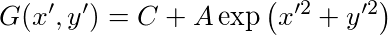
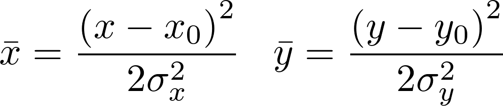
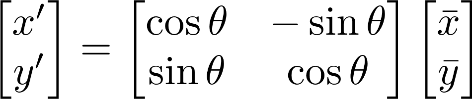

#Documentation
##`align_sped.py`

### `gaussian_2d`
__gaussian_2d(__ _xdata_tuple, amplitude, xo, yo, sigma_x, sigma_y, theta, offset_ __)__

Compute the twodimensional gaussian according to: 

where the coordinates are defined as 

and rotated according to

It has an amplitude _amplitude_ centered on (_xo_, _yo_) with widths _sigma\_x_ and _sigma\_y_. The gaussian may rotate _theta_ degrees about the horisontal axis and have a baseline of _offset_.

#### Parameters and Returns
| | |
| --- | --- |
| __Parameters__: | __xdata\_tuple__: _2-tuple_ &nbsp;&nbsp;&nbsp;&nbsp;&nbsp;The x and y pixel coordinates each of shape _NxM_. Made for instance by calling `xdata_tuple=(x, y) = numpy.mgrid[:N, :M]`|
|  | __amplitude__: _scalar_ &nbsp;&nbsp;&nbsp;&nbsp;&nbsp;The amplitude of the Gaussian|
|  | __xo__: _scalar_  &nbsp;&nbsp;&nbsp;&nbsp;&nbsp;The vertical origin of the gaussian|
|  | __yo__: _scalar_  &nbsp;&nbsp;&nbsp;&nbsp;&nbsp;The horizontal origin of the gaussian|
|  | __sigma\_x__: _scalar_  &nbsp;&nbsp;&nbsp;&nbsp;&nbsp;The spread of the gaussian in (unrotated) vertical direction|
|  | __sigma\_y__: _scalar_  &nbsp;&nbsp;&nbsp;&nbsp;&nbsp;The spread of the gaussian in (unrotated) horizontal direction|
|  | __theta__: _scalar_  &nbsp;&nbsp;&nbsp;&nbsp;&nbsp;The rotation of the gaussian measured in degrees positively in the cockwise direction|
|  | __offset__: _scalar_  &nbsp;&nbsp;&nbsp;&nbsp;&nbsp;The baseline (constant value) of the Gaussian|
| __Returns__: | __g__: _1d array or None_ &nbsp;&nbsp;&nbsp;&nbsp;&nbsp;If acceptable input types were provided, returns a one dimensional `numpy` array of length _N*M_ that can be reshaped into a proper 2d array by calling `g.reshape(numpy.shape(xdata_tuple[0]))`. If the input parameters are not of correct type, returns `None` and prints a warning|
| __Raises__: | No warnings or errors should be raised.|
|  | __ValueErrors__ are catched and not passed on|

## `test_gaussian_2d.py`

## `main.py`
